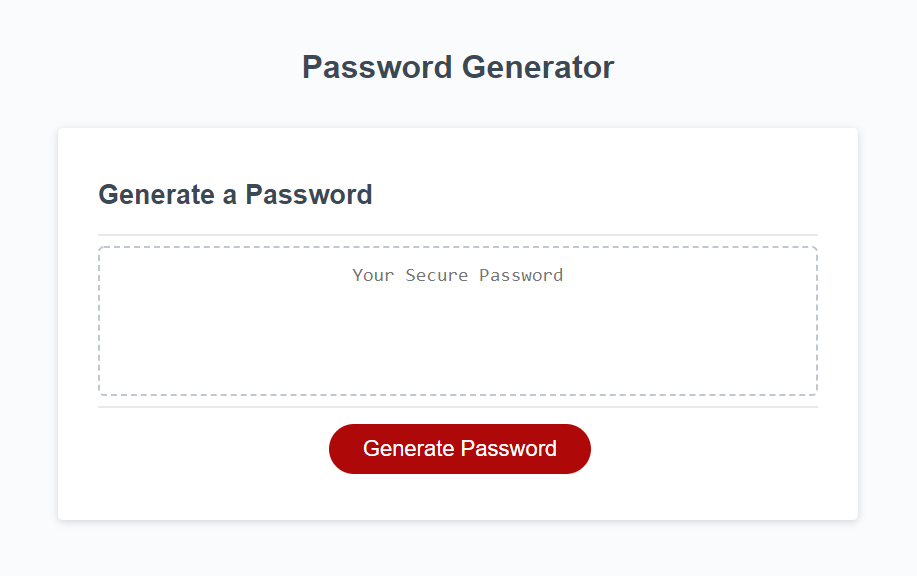

# Joseph DeFelice Password-Generator

A random password generator that takes user input to define the password parameters.

The password must be at least 8 characters and no more than 128 characters in length. Next, a series of prompts will take user input to determine which character sets to include in the password: special, numeric, lowercase, or uppercase charcters.

The resulting password will then display within the password box.

Deployed URL: https://joseph-d98.github.io/password-generator/
